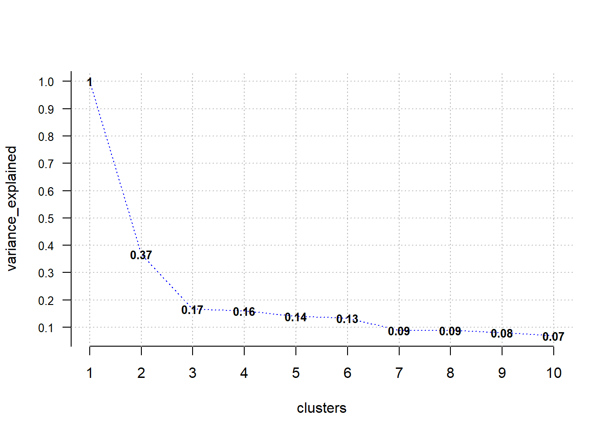
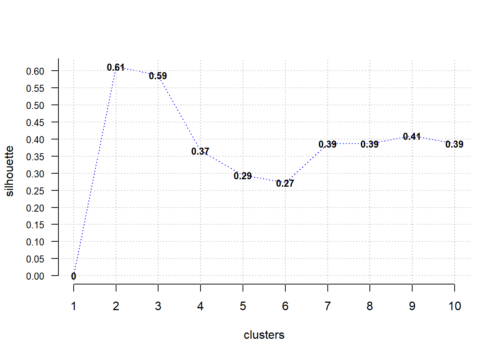
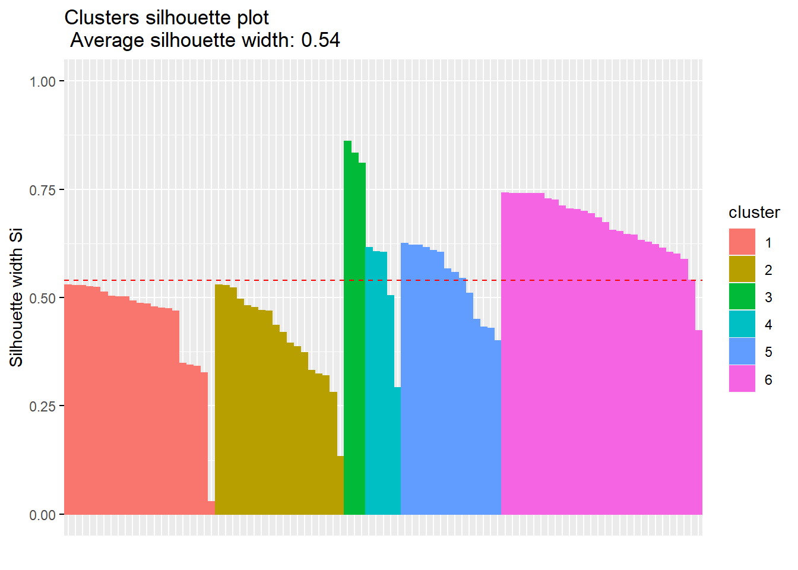
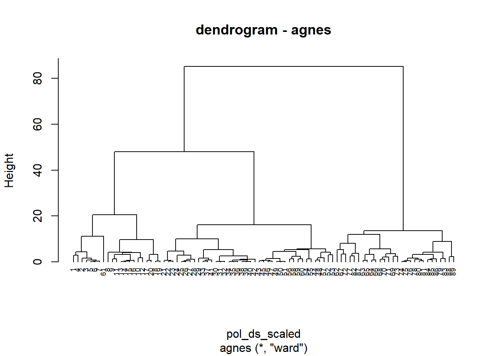
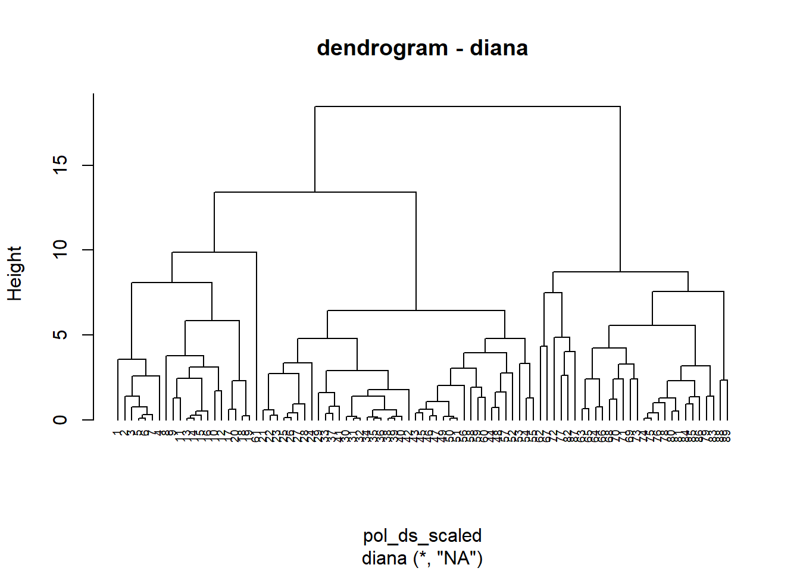

## Introduction

Clustering in an unsupervised learning technique that uses machine learning 
algorithms to assign similar data to groups. Mostly it is used for knowledge 
discovery of hidden patterns found within data. The main idea is to cluster 
similar observations that they are grouped together. The more diverse groups
the better.

## Dataset

### International Politcal Economy

International Political Economy is a discipline that discusses economics, politics
and international relations. The main areas of economics that are covered by IPE 
are the following fields of macroeconomics, international business, international 
development and development economics. 

### The nature of the dataset

In order to provide master dataset that can be used by researchers from
international political economy 89 data resources have been merged. Observations
are identified by country-year the unit of analysis. Countries are identified by 
Gleditsch-Ward number ot in an alternative version by Correlates of War (COW).
Most of the dataset components begin after Second World War. 

### Variable naming

Each of 89 dataset has been given a unique suffix that uniquely identifies it.

## Dataset preprocessing

Firstly data is loaded, then we convert it to tibble as tidyverse will be 
mainly used in this project.


```r
load(paste0("data/", "master_ipe_v4.rdata"))
ipe_v4 <- as_tibble(ipe_v4)
```

Dimensions of the dataset needs to be investigated as well.


```r
ipe_v4 %>% dim()
```

[1] 25850  1043


Master table consists of 25850 rows and 1043 variables. Each of them is described 
in the codebook provided by library maintainers. They are divided into following 
groups:
* economic
* political
* social and cultural
* geographic 
* other (e.g. infrastructure, military)

Very good quality of the data is provided by Varities of Democracy Dataset (VDEM)
inside political section, it will definitely be included not only because of 
the quality but also its popularity and inside class recommendation. 

The other  dataset chosen by me is going to be "Polity IV Democracy".


```r
pol_ds <- 
  ipe_v4 %>% 
  filter(country == "Poland", year > 1918, 
         !(year %in% c(1939, 1940, 1941, 1942, 1943, 1944, 1945, 2020))) %>% 
  select(year, starts_with("v2"), contains("P4"), 
         -c(change_P4, sf_P4, fragment_P4, regtrans_P4, countryname_raw_P4, 
            v2x_hosinter_VDEM, v2x_suffr_VDEM, v2elsrgel_VDEM, v2elreggov_VDEM,
            v2xlg_leginter_VDEM, v2x_elecreg_VDEM, v2xlg_elecreg_VDEM)) 
pol_ds %>%
  head() %>% 
  kable()
```

<table>
 <thead>
  <tr>
   <th style="text-align:right;"> year </th>
   <th style="text-align:right;"> v2x_polyarchy_VDEM </th>
   <th style="text-align:right;"> v2x_api_VDEM </th>
   <th style="text-align:right;"> v2x_mpi_VDEM </th>
   <th style="text-align:right;"> v2x_EDcomp_thick_VDEM </th>
   <th style="text-align:right;"> v2x_libdem_VDEM </th>
   <th style="text-align:right;"> v2x_liberal_VDEM </th>
   <th style="text-align:right;"> v2x_partipdem_VDEM </th>
   <th style="text-align:right;"> v2x_partip_VDEM </th>
   <th style="text-align:right;"> v2x_delibdem_VDEM </th>
   <th style="text-align:right;"> v2xdl_delib_VDEM </th>
   <th style="text-align:right;"> v2x_egaldem_VDEM </th>
   <th style="text-align:right;"> v2x_egal_VDEM </th>
   <th style="text-align:right;"> v2x_frassoc_thick_VDEM </th>
   <th style="text-align:right;"> v2x_freexp_altinf_VDEM </th>
   <th style="text-align:right;"> v2xme_altinf_VDEM </th>
   <th style="text-align:right;"> v2xel_frefair_VDEM </th>
   <th style="text-align:right;"> v2x_elecoff_VDEM </th>
   <th style="text-align:right;"> v2xcl_rol_VDEM </th>
   <th style="text-align:right;"> v2x_jucon_VDEM </th>
   <th style="text-align:right;"> v2xlg_legcon_VDEM </th>
   <th style="text-align:right;"> v2x_cspart_VDEM </th>
   <th style="text-align:right;"> v2xdd_dd_VDEM </th>
   <th style="text-align:right;"> v2xel_locelec_VDEM </th>
   <th style="text-align:right;"> v2xel_regelec_VDEM </th>
   <th style="text-align:right;"> v2xeg_eqprotec_VDEM </th>
   <th style="text-align:right;"> v2xeg_eqdr_VDEM </th>
   <th style="text-align:right;"> v2xcs_ccsi_VDEM </th>
   <th style="text-align:right;"> v2xps_party_VDEM </th>
   <th style="text-align:right;"> v2x_gender_VDEM </th>
   <th style="text-align:right;"> v2x_gencl_VDEM </th>
   <th style="text-align:right;"> v2x_gencs_VDEM </th>
   <th style="text-align:right;"> v2x_genpp_VDEM </th>
   <th style="text-align:right;"> v2xex_elecreg_VDEM </th>
   <th style="text-align:right;"> v2xel_elecparl_VDEM </th>
   <th style="text-align:right;"> v2xel_elecpres_VDEM </th>
   <th style="text-align:right;"> v2x_corr_VDEM </th>
   <th style="text-align:right;"> v2x_pubcorr_VDEM </th>
   <th style="text-align:right;"> v2x_execorr_VDEM </th>
   <th style="text-align:right;"> v2x_divparctrl_VDEM </th>
   <th style="text-align:right;"> v2x_feduni_VDEM </th>
   <th style="text-align:right;"> v2x_civlib_VDEM </th>
   <th style="text-align:right;"> v2x_clphy_VDEM </th>
   <th style="text-align:right;"> v2x_clpol_VDEM </th>
   <th style="text-align:right;"> v2x_clpriv_VDEM </th>
   <th style="text-align:right;"> v2cltrnslw_VDEM </th>
   <th style="text-align:right;"> v2juhcind_VDEM </th>
   <th style="text-align:right;"> v2juhccomp_VDEM </th>
   <th style="text-align:right;"> v2excrptps_VDEM </th>
   <th style="text-align:right;"> v2jucorrdc_VDEM </th>
   <th style="text-align:right;"> v2exbribe_VDEM </th>
   <th style="text-align:right;"> v2lgcrrpt_VDEM </th>
   <th style="text-align:right;"> democ_P4 </th>
   <th style="text-align:right;"> autoc_P4 </th>
   <th style="text-align:right;"> polity_P4 </th>
   <th style="text-align:right;"> polity2_P4 </th>
   <th style="text-align:right;"> durable_P4 </th>
   <th style="text-align:right;"> xconst_P4 </th>
   <th style="text-align:right;"> parreg_P4 </th>
   <th style="text-align:right;"> parcomp_P4 </th>
   <th style="text-align:right;"> polcomp_P4 </th>
  </tr>
 </thead>
<tbody>
  <tr>
   <td style="text-align:right;"> 1919 </td>
   <td style="text-align:right;"> 0.362 </td>
   <td style="text-align:right;"> 0.700 </td>
   <td style="text-align:right;"> 0.023 </td>
   <td style="text-align:right;"> 0.321 </td>
   <td style="text-align:right;"> 0.336 </td>
   <td style="text-align:right;"> 0.814 </td>
   <td style="text-align:right;"> 0.154 </td>
   <td style="text-align:right;"> 0.296 </td>
   <td style="text-align:right;"> 0.270 </td>
   <td style="text-align:right;"> 0.694 </td>
   <td style="text-align:right;"> 0.250 </td>
   <td style="text-align:right;"> 0.565 </td>
   <td style="text-align:right;"> 0.820 </td>
   <td style="text-align:right;"> 0.859 </td>
   <td style="text-align:right;"> 0.786 </td>
   <td style="text-align:right;"> 0.648 </td>
   <td style="text-align:right;"> 1 </td>
   <td style="text-align:right;"> 0.863 </td>
   <td style="text-align:right;"> 0.891 </td>
   <td style="text-align:right;"> 0.701 </td>
   <td style="text-align:right;"> 0.583 </td>
   <td style="text-align:right;"> 0 </td>
   <td style="text-align:right;"> 0.274 </td>
   <td style="text-align:right;"> 0.019 </td>
   <td style="text-align:right;"> 0.591 </td>
   <td style="text-align:right;"> 0.510 </td>
   <td style="text-align:right;"> 0.819 </td>
   <td style="text-align:right;"> 0.624 </td>
   <td style="text-align:right;"> 0.623 </td>
   <td style="text-align:right;"> 0.817 </td>
   <td style="text-align:right;"> 0.505 </td>
   <td style="text-align:right;"> 0.522 </td>
   <td style="text-align:right;"> 0 </td>
   <td style="text-align:right;"> 1 </td>
   <td style="text-align:right;"> 0 </td>
   <td style="text-align:right;"> 0.168 </td>
   <td style="text-align:right;"> 0.193 </td>
   <td style="text-align:right;"> 0.136 </td>
   <td style="text-align:right;"> 0.678 </td>
   <td style="text-align:right;"> 0.136 </td>
   <td style="text-align:right;"> 0.841 </td>
   <td style="text-align:right;"> 0.872 </td>
   <td style="text-align:right;"> 0.858 </td>
   <td style="text-align:right;"> 0.818 </td>
   <td style="text-align:right;"> 1.993 </td>
   <td style="text-align:right;"> 1.381 </td>
   <td style="text-align:right;"> 1.5 </td>
   <td style="text-align:right;"> 1.067 </td>
   <td style="text-align:right;"> 2.478 </td>
   <td style="text-align:right;"> 1.312 </td>
   <td style="text-align:right;"> 0.465 </td>
   <td style="text-align:right;"> 8 </td>
   <td style="text-align:right;"> 0 </td>
   <td style="text-align:right;"> 8 </td>
   <td style="text-align:right;"> 8 </td>
   <td style="text-align:right;"> 1 </td>
   <td style="text-align:right;"> 7 </td>
   <td style="text-align:right;"> 2 </td>
   <td style="text-align:right;"> 3 </td>
   <td style="text-align:right;"> 7 </td>
  </tr>
  <tr>
   <td style="text-align:right;"> 1920 </td>
   <td style="text-align:right;"> 0.641 </td>
   <td style="text-align:right;"> 0.831 </td>
   <td style="text-align:right;"> 0.450 </td>
   <td style="text-align:right;"> 0.690 </td>
   <td style="text-align:right;"> 0.526 </td>
   <td style="text-align:right;"> 0.807 </td>
   <td style="text-align:right;"> 0.258 </td>
   <td style="text-align:right;"> 0.267 </td>
   <td style="text-align:right;"> 0.469 </td>
   <td style="text-align:right;"> 0.686 </td>
   <td style="text-align:right;"> 0.411 </td>
   <td style="text-align:right;"> 0.565 </td>
   <td style="text-align:right;"> 0.832 </td>
   <td style="text-align:right;"> 0.859 </td>
   <td style="text-align:right;"> 0.786 </td>
   <td style="text-align:right;"> 0.608 </td>
   <td style="text-align:right;"> 1 </td>
   <td style="text-align:right;"> 0.864 </td>
   <td style="text-align:right;"> 0.893 </td>
   <td style="text-align:right;"> 0.701 </td>
   <td style="text-align:right;"> 0.579 </td>
   <td style="text-align:right;"> 0 </td>
   <td style="text-align:right;"> 0.271 </td>
   <td style="text-align:right;"> 0.019 </td>
   <td style="text-align:right;"> 0.591 </td>
   <td style="text-align:right;"> 0.510 </td>
   <td style="text-align:right;"> 0.819 </td>
   <td style="text-align:right;"> 0.614 </td>
   <td style="text-align:right;"> NA </td>
   <td style="text-align:right;"> 0.817 </td>
   <td style="text-align:right;"> 0.505 </td>
   <td style="text-align:right;"> NA </td>
   <td style="text-align:right;"> 0 </td>
   <td style="text-align:right;"> 0 </td>
   <td style="text-align:right;"> 0 </td>
   <td style="text-align:right;"> 0.173 </td>
   <td style="text-align:right;"> 0.203 </td>
   <td style="text-align:right;"> 0.146 </td>
   <td style="text-align:right;"> 0.678 </td>
   <td style="text-align:right;"> 0.135 </td>
   <td style="text-align:right;"> 0.839 </td>
   <td style="text-align:right;"> 0.872 </td>
   <td style="text-align:right;"> 0.867 </td>
   <td style="text-align:right;"> 0.824 </td>
   <td style="text-align:right;"> 1.997 </td>
   <td style="text-align:right;"> 1.381 </td>
   <td style="text-align:right;"> 1.5 </td>
   <td style="text-align:right;"> 0.964 </td>
   <td style="text-align:right;"> 2.478 </td>
   <td style="text-align:right;"> 1.312 </td>
   <td style="text-align:right;"> 0.465 </td>
   <td style="text-align:right;"> 8 </td>
   <td style="text-align:right;"> 0 </td>
   <td style="text-align:right;"> 8 </td>
   <td style="text-align:right;"> 8 </td>
   <td style="text-align:right;"> 2 </td>
   <td style="text-align:right;"> 7 </td>
   <td style="text-align:right;"> 2 </td>
   <td style="text-align:right;"> 3 </td>
   <td style="text-align:right;"> 7 </td>
  </tr>
  <tr>
   <td style="text-align:right;"> 1921 </td>
   <td style="text-align:right;"> 0.640 </td>
   <td style="text-align:right;"> 0.832 </td>
   <td style="text-align:right;"> 0.449 </td>
   <td style="text-align:right;"> 0.686 </td>
   <td style="text-align:right;"> 0.512 </td>
   <td style="text-align:right;"> 0.794 </td>
   <td style="text-align:right;"> 0.261 </td>
   <td style="text-align:right;"> 0.267 </td>
   <td style="text-align:right;"> 0.482 </td>
   <td style="text-align:right;"> 0.710 </td>
   <td style="text-align:right;"> 0.430 </td>
   <td style="text-align:right;"> 0.603 </td>
   <td style="text-align:right;"> 0.801 </td>
   <td style="text-align:right;"> 0.859 </td>
   <td style="text-align:right;"> 0.786 </td>
   <td style="text-align:right;"> 0.608 </td>
   <td style="text-align:right;"> 1 </td>
   <td style="text-align:right;"> 0.864 </td>
   <td style="text-align:right;"> 0.893 </td>
   <td style="text-align:right;"> 0.690 </td>
   <td style="text-align:right;"> 0.579 </td>
   <td style="text-align:right;"> 0 </td>
   <td style="text-align:right;"> 0.271 </td>
   <td style="text-align:right;"> 0.019 </td>
   <td style="text-align:right;"> 0.591 </td>
   <td style="text-align:right;"> 0.571 </td>
   <td style="text-align:right;"> 0.819 </td>
   <td style="text-align:right;"> 0.614 </td>
   <td style="text-align:right;"> 0.655 </td>
   <td style="text-align:right;"> 0.857 </td>
   <td style="text-align:right;"> 0.505 </td>
   <td style="text-align:right;"> 0.563 </td>
   <td style="text-align:right;"> 0 </td>
   <td style="text-align:right;"> 0 </td>
   <td style="text-align:right;"> 0 </td>
   <td style="text-align:right;"> 0.195 </td>
   <td style="text-align:right;"> 0.214 </td>
   <td style="text-align:right;"> 0.146 </td>
   <td style="text-align:right;"> 0.678 </td>
   <td style="text-align:right;"> 0.135 </td>
   <td style="text-align:right;"> 0.847 </td>
   <td style="text-align:right;"> 0.872 </td>
   <td style="text-align:right;"> 0.857 </td>
   <td style="text-align:right;"> 0.830 </td>
   <td style="text-align:right;"> 1.997 </td>
   <td style="text-align:right;"> 1.381 </td>
   <td style="text-align:right;"> 1.5 </td>
   <td style="text-align:right;"> 0.964 </td>
   <td style="text-align:right;"> 2.478 </td>
   <td style="text-align:right;"> 1.312 </td>
   <td style="text-align:right;"> 0.294 </td>
   <td style="text-align:right;"> 8 </td>
   <td style="text-align:right;"> 0 </td>
   <td style="text-align:right;"> 8 </td>
   <td style="text-align:right;"> 8 </td>
   <td style="text-align:right;"> 3 </td>
   <td style="text-align:right;"> 7 </td>
   <td style="text-align:right;"> 2 </td>
   <td style="text-align:right;"> 3 </td>
   <td style="text-align:right;"> 7 </td>
  </tr>
  <tr>
   <td style="text-align:right;"> 1922 </td>
   <td style="text-align:right;"> 0.638 </td>
   <td style="text-align:right;"> 0.830 </td>
   <td style="text-align:right;"> 0.446 </td>
   <td style="text-align:right;"> 0.685 </td>
   <td style="text-align:right;"> 0.526 </td>
   <td style="text-align:right;"> 0.811 </td>
   <td style="text-align:right;"> 0.259 </td>
   <td style="text-align:right;"> 0.267 </td>
   <td style="text-align:right;"> 0.480 </td>
   <td style="text-align:right;"> 0.710 </td>
   <td style="text-align:right;"> 0.431 </td>
   <td style="text-align:right;"> 0.620 </td>
   <td style="text-align:right;"> 0.797 </td>
   <td style="text-align:right;"> 0.859 </td>
   <td style="text-align:right;"> 0.786 </td>
   <td style="text-align:right;"> 0.614 </td>
   <td style="text-align:right;"> 1 </td>
   <td style="text-align:right;"> 0.870 </td>
   <td style="text-align:right;"> 0.893 </td>
   <td style="text-align:right;"> 0.710 </td>
   <td style="text-align:right;"> 0.579 </td>
   <td style="text-align:right;"> 0 </td>
   <td style="text-align:right;"> 0.271 </td>
   <td style="text-align:right;"> 0.019 </td>
   <td style="text-align:right;"> 0.591 </td>
   <td style="text-align:right;"> 0.571 </td>
   <td style="text-align:right;"> 0.819 </td>
   <td style="text-align:right;"> 0.614 </td>
   <td style="text-align:right;"> 0.642 </td>
   <td style="text-align:right;"> 0.846 </td>
   <td style="text-align:right;"> 0.505 </td>
   <td style="text-align:right;"> 0.567 </td>
   <td style="text-align:right;"> 0 </td>
   <td style="text-align:right;"> 1 </td>
   <td style="text-align:right;"> 0 </td>
   <td style="text-align:right;"> 0.197 </td>
   <td style="text-align:right;"> 0.214 </td>
   <td style="text-align:right;"> 0.155 </td>
   <td style="text-align:right;"> 0.678 </td>
   <td style="text-align:right;"> 0.135 </td>
   <td style="text-align:right;"> 0.853 </td>
   <td style="text-align:right;"> 0.872 </td>
   <td style="text-align:right;"> 0.857 </td>
   <td style="text-align:right;"> 0.821 </td>
   <td style="text-align:right;"> 1.997 </td>
   <td style="text-align:right;"> 1.381 </td>
   <td style="text-align:right;"> 1.5 </td>
   <td style="text-align:right;"> 0.964 </td>
   <td style="text-align:right;"> 2.478 </td>
   <td style="text-align:right;"> 1.220 </td>
   <td style="text-align:right;"> 0.294 </td>
   <td style="text-align:right;"> 8 </td>
   <td style="text-align:right;"> 0 </td>
   <td style="text-align:right;"> 8 </td>
   <td style="text-align:right;"> 8 </td>
   <td style="text-align:right;"> 4 </td>
   <td style="text-align:right;"> 7 </td>
   <td style="text-align:right;"> 2 </td>
   <td style="text-align:right;"> 3 </td>
   <td style="text-align:right;"> 7 </td>
  </tr>
  <tr>
   <td style="text-align:right;"> 1923 </td>
   <td style="text-align:right;"> 0.629 </td>
   <td style="text-align:right;"> 0.824 </td>
   <td style="text-align:right;"> 0.435 </td>
   <td style="text-align:right;"> 0.677 </td>
   <td style="text-align:right;"> 0.515 </td>
   <td style="text-align:right;"> 0.811 </td>
   <td style="text-align:right;"> 0.249 </td>
   <td style="text-align:right;"> 0.267 </td>
   <td style="text-align:right;"> 0.464 </td>
   <td style="text-align:right;"> 0.710 </td>
   <td style="text-align:right;"> 0.411 </td>
   <td style="text-align:right;"> 0.620 </td>
   <td style="text-align:right;"> 0.782 </td>
   <td style="text-align:right;"> 0.859 </td>
   <td style="text-align:right;"> 0.786 </td>
   <td style="text-align:right;"> 0.675 </td>
   <td style="text-align:right;"> 1 </td>
   <td style="text-align:right;"> 0.870 </td>
   <td style="text-align:right;"> 0.893 </td>
   <td style="text-align:right;"> 0.710 </td>
   <td style="text-align:right;"> 0.579 </td>
   <td style="text-align:right;"> 0 </td>
   <td style="text-align:right;"> 0.271 </td>
   <td style="text-align:right;"> 0.019 </td>
   <td style="text-align:right;"> 0.591 </td>
   <td style="text-align:right;"> 0.571 </td>
   <td style="text-align:right;"> 0.819 </td>
   <td style="text-align:right;"> 0.614 </td>
   <td style="text-align:right;"> 0.610 </td>
   <td style="text-align:right;"> 0.846 </td>
   <td style="text-align:right;"> 0.461 </td>
   <td style="text-align:right;"> 0.567 </td>
   <td style="text-align:right;"> 0 </td>
   <td style="text-align:right;"> 0 </td>
   <td style="text-align:right;"> 0 </td>
   <td style="text-align:right;"> 0.197 </td>
   <td style="text-align:right;"> 0.214 </td>
   <td style="text-align:right;"> 0.155 </td>
   <td style="text-align:right;"> 0.678 </td>
   <td style="text-align:right;"> 0.135 </td>
   <td style="text-align:right;"> 0.857 </td>
   <td style="text-align:right;"> 0.872 </td>
   <td style="text-align:right;"> 0.858 </td>
   <td style="text-align:right;"> 0.821 </td>
   <td style="text-align:right;"> 1.997 </td>
   <td style="text-align:right;"> 1.381 </td>
   <td style="text-align:right;"> 1.5 </td>
   <td style="text-align:right;"> 0.964 </td>
   <td style="text-align:right;"> 2.478 </td>
   <td style="text-align:right;"> 1.220 </td>
   <td style="text-align:right;"> 0.294 </td>
   <td style="text-align:right;"> 8 </td>
   <td style="text-align:right;"> 0 </td>
   <td style="text-align:right;"> 8 </td>
   <td style="text-align:right;"> 8 </td>
   <td style="text-align:right;"> 5 </td>
   <td style="text-align:right;"> 7 </td>
   <td style="text-align:right;"> 2 </td>
   <td style="text-align:right;"> 3 </td>
   <td style="text-align:right;"> 7 </td>
  </tr>
  <tr>
   <td style="text-align:right;"> 1924 </td>
   <td style="text-align:right;"> 0.629 </td>
   <td style="text-align:right;"> 0.824 </td>
   <td style="text-align:right;"> 0.435 </td>
   <td style="text-align:right;"> 0.677 </td>
   <td style="text-align:right;"> 0.515 </td>
   <td style="text-align:right;"> 0.811 </td>
   <td style="text-align:right;"> 0.249 </td>
   <td style="text-align:right;"> 0.267 </td>
   <td style="text-align:right;"> 0.464 </td>
   <td style="text-align:right;"> 0.710 </td>
   <td style="text-align:right;"> 0.411 </td>
   <td style="text-align:right;"> 0.620 </td>
   <td style="text-align:right;"> 0.782 </td>
   <td style="text-align:right;"> 0.859 </td>
   <td style="text-align:right;"> 0.786 </td>
   <td style="text-align:right;"> 0.675 </td>
   <td style="text-align:right;"> 1 </td>
   <td style="text-align:right;"> 0.870 </td>
   <td style="text-align:right;"> 0.893 </td>
   <td style="text-align:right;"> 0.710 </td>
   <td style="text-align:right;"> 0.579 </td>
   <td style="text-align:right;"> 0 </td>
   <td style="text-align:right;"> 0.271 </td>
   <td style="text-align:right;"> 0.019 </td>
   <td style="text-align:right;"> 0.591 </td>
   <td style="text-align:right;"> 0.571 </td>
   <td style="text-align:right;"> 0.819 </td>
   <td style="text-align:right;"> 0.614 </td>
   <td style="text-align:right;"> 0.610 </td>
   <td style="text-align:right;"> 0.846 </td>
   <td style="text-align:right;"> 0.461 </td>
   <td style="text-align:right;"> 0.567 </td>
   <td style="text-align:right;"> 0 </td>
   <td style="text-align:right;"> 0 </td>
   <td style="text-align:right;"> 0 </td>
   <td style="text-align:right;"> 0.197 </td>
   <td style="text-align:right;"> 0.214 </td>
   <td style="text-align:right;"> 0.155 </td>
   <td style="text-align:right;"> 0.678 </td>
   <td style="text-align:right;"> 0.135 </td>
   <td style="text-align:right;"> 0.857 </td>
   <td style="text-align:right;"> 0.872 </td>
   <td style="text-align:right;"> 0.858 </td>
   <td style="text-align:right;"> 0.821 </td>
   <td style="text-align:right;"> 1.997 </td>
   <td style="text-align:right;"> 1.381 </td>
   <td style="text-align:right;"> 1.5 </td>
   <td style="text-align:right;"> 0.964 </td>
   <td style="text-align:right;"> 2.478 </td>
   <td style="text-align:right;"> 1.220 </td>
   <td style="text-align:right;"> 0.294 </td>
   <td style="text-align:right;"> 8 </td>
   <td style="text-align:right;"> 0 </td>
   <td style="text-align:right;"> 8 </td>
   <td style="text-align:right;"> 8 </td>
   <td style="text-align:right;"> 6 </td>
   <td style="text-align:right;"> 7 </td>
   <td style="text-align:right;"> 2 </td>
   <td style="text-align:right;"> 3 </td>
   <td style="text-align:right;"> 7 </td>
  </tr>
</tbody>
</table>

## Exploratory data analysis

In every modeling process we should perform exploratory data analysis before moving to 
the next points. 


```r
dfSummary(pol_ds, plain.ascii = FALSE, style = "grid", 
          graph.magnif = 0.75, valid.col = FALSE, tmp.img.dir = "/tmp")
```

```
## temporary images written to 'E:\tmp'
```

### Data Frame Summary  
**pol_ds**   
**Dimensions:** 89 x 61  
**Duplicates:** 0  

+----+-------------------------+--------------------------+--------------------+----------------------+---------+
| No | Variable                | Stats / Values           | Freqs (% of Valid) | Graph                | Missing |
+====+=========================+==========================+====================+======================+=========+
| 1  | year\                   | Mean (sd) : 1970.8 (29)\ | 89 distinct values |  | 0\      |
|    | [numeric]               | min < med < max:\        |                    |                      | (0.0%)  |
|    |                         | 1919 < 1973 < 2017\      |                    |                      |         |
|    |                         | IQR (CV) : 44 (0)        |                    |                      |         |
+----+-------------------------+--------------------------+--------------------+----------------------+---------+
| 2  | v2x_polyarchy_VDEM\     | Mean (sd) : 0.4 (0.3)\   | 54 distinct values |  | 0\      |
|    | [numeric]               | min < med < max:\        |                    |                      | (0.0%)  |
|    |                         | 0.2 < 0.3 < 0.9\         |                    |                      |         |
|    |                         | IQR (CV) : 0.7 (0.7)     |                    |                      |         |
+----+-------------------------+--------------------------+--------------------+----------------------+---------+
| 3  | v2x_api_VDEM\           | Mean (sd) : 0.6 (0.3)\   | 53 distinct values |  | 0\      |
|    | [numeric]               | min < med < max:\        |                    |                      | (0.0%)  |
|    |                         | 0.3 < 0.5 < 1\           |                    |                      |         |
|    |                         | IQR (CV) : 0.6 (0.4)     |                    |                      |         |
+----+-------------------------+--------------------------+--------------------+----------------------+---------+
| 4  | v2x_mpi_VDEM\           | Mean (sd) : 0.3 (0.4)\   | 38 distinct values |  | 0\      |
|    | [numeric]               | min < med < max:\        |                    |                      | (0.0%)  |
|    |                         | 0 < 0 < 0.9\             |                    |                      |         |
|    |                         | IQR (CV) : 0.8 (1.3)     |                    |                      |         |
+----+-------------------------+--------------------------+--------------------+----------------------+---------+
| 5  | v2x_EDcomp_thick_VDEM\  | Mean (sd) : 0.5 (0.3)\   | 55 distinct values |  | 0\      |
|    | [numeric]               | min < med < max:\        |                    |                      | (0.0%)  |
|    |                         | 0.2 < 0.3 < 0.9\         |                    |                      |         |
|    |                         | IQR (CV) : 0.6 (0.5)     |                    |                      |         |
+----+-------------------------+--------------------------+--------------------+----------------------+---------+
| 6  | v2x_libdem_VDEM\        | Mean (sd) : 0.4 (0.3)\   | 58 distinct values |  | 0\      |
|    | [numeric]               | min < med < max:\        |                    |                      | (0.0%)  |
|    |                         | 0.1 < 0.2 < 0.9\         |                    |                      |         |
|    |                         | IQR (CV) : 0.6 (0.8)     |                    |                      |         |
+----+-------------------------+--------------------------+--------------------+----------------------+---------+
| 7  | v2x_liberal_VDEM\       | Mean (sd) : 0.6 (0.2)\   | 57 distinct values |  | 0\      |
|    | [numeric]               | min < med < max:\        |                    |                      | (0.0%)  |
|    |                         | 0.3 < 0.6 < 1\           |                    |                      |         |
|    |                         | IQR (CV) : 0.5 (0.4)     |                    |                      |         |
+----+-------------------------+--------------------------+--------------------+----------------------+---------+
| 8  | v2x_partipdem_VDEM\     | Mean (sd) : 0.3 (0.3)\   | 57 distinct values |  | 0\      |
|    | [numeric]               | min < med < max:\        |                    |                      | (0.0%)  |
|    |                         | 0 < 0.1 < 0.7\           |                    |                      |         |
|    |                         | IQR (CV) : 0.5 (1)       |                    |                      |         |
+----+-------------------------+--------------------------+--------------------+----------------------+---------+
| 9  | v2x_partip_VDEM\        | Mean (sd) : 0.3 (0.2)\   | 39 distinct values |  | 0\      |
|    | [numeric]               | min < med < max:\        |                    |                      | (0.0%)  |
|    |                         | 0.1 < 0.3 < 0.7\         |                    |                      |         |
|    |                         | IQR (CV) : 0.5 (0.8)     |                    |                      |         |
+----+-------------------------+--------------------------+--------------------+----------------------+---------+
| 10 | v2x_delibdem_VDEM\      | Mean (sd) : 0.3 (0.3)\   | 58 distinct values |  | 0\      |
|    | [numeric]               | min < med < max:\        |                    |                      | (0.0%)  |
|    |                         | 0 < 0.2 < 0.8\           |                    |                      |         |
|    |                         | IQR (CV) : 0.6 (1)       |                    |                      |         |
+----+-------------------------+--------------------------+--------------------+----------------------+---------+
| 11 | v2xdl_delib_VDEM\       | Mean (sd) : 0.4 (0.3)\   | 42 distinct values |  | 0\      |
|    | [numeric]               | min < med < max:\        |                    |                      | (0.0%)  |
|    |                         | 0 < 0.4 < 0.9\           |                    |                      |         |
|    |                         | IQR (CV) : 0.7 (0.7)     |                    |                      |         |
+----+-------------------------+--------------------------+--------------------+----------------------+---------+
| 12 | v2x_egaldem_VDEM\       | Mean (sd) : 0.4 (0.2)\   | 52 distinct values |  | 0\      |
|    | [numeric]               | min < med < max:\        |                    |                      | (0.0%)  |
|    |                         | 0.2 < 0.2 < 0.8\         |                    |                      |         |
|    |                         | IQR (CV) : 0.5 (0.6)     |                    |                      |         |
+----+-------------------------+--------------------------+--------------------+----------------------+---------+
| 13 | v2x_egal_VDEM\          | Mean (sd) : 0.8 (0.1)\   | 28 distinct values |  | 0\      |
|    | [numeric]               | min < med < max:\        |                    |                      | (0.0%)  |
|    |                         | 0.6 < 0.8 < 0.9\         |                    |                      |         |
|    |                         | IQR (CV) : 0.1 (0.1)     |                    |                      |         |
+----+-------------------------+--------------------------+--------------------+----------------------+---------+
| 14 | v2x_frassoc_thick_VDEM\ | Mean (sd) : 0.5 (0.4)\   | 52 distinct values |  | 0\      |
|    | [numeric]               | min < med < max:\        |                    |                      | (0.0%)  |
|    |                         | 0.1 < 0.4 < 0.9\         |                    |                      |         |
|    |                         | IQR (CV) : 0.8 (0.8)     |                    |                      |         |
+----+-------------------------+--------------------------+--------------------+----------------------+---------+
| 15 | v2x_freexp_altinf_VDEM\ | Mean (sd) : 0.5 (0.4)\   | 37 distinct values |  | 0\      |
|    | [numeric]               | min < med < max:\        |                    |                      | (0.0%)  |
|    |                         | 0.1 < 0.6 < 1\           |                    |                      |         |
|    |                         | IQR (CV) : 0.8 (0.7)     |                    |                      |         |
+----+-------------------------+--------------------------+--------------------+----------------------+---------+
| 16 | v2xme_altinf_VDEM\      | Mean (sd) : 0.5 (0.4)\   | 20 distinct values |  | 0\      |
|    | [numeric]               | min < med < max:\        |                    |                      | (0.0%)  |
|    |                         | 0.1 < 0.5 < 0.9\         |                    |                      |         |
|    |                         | IQR (CV) : 0.8 (0.8)     |                    |                      |         |
+----+-------------------------+--------------------------+--------------------+----------------------+---------+
| 17 | v2xel_frefair_VDEM\     | Mean (sd) : 0.5 (0.3)\   | 51 distinct values |  | 0\      |
|    | [numeric]               | min < med < max:\        |                    |                      | (0.0%)  |
|    |                         | 0.2 < 0.3 < 1\           |                    |                      |         |
|    |                         | IQR (CV) : 0.7 (0.6)     |                    |                      |         |
+----+-------------------------+--------------------------+--------------------+----------------------+---------+
| 18 | v2x_elecoff_VDEM\       | Mean (sd) : 0.9 (0.3)\   | 0.00 :  9 (10.1%)\ |  | 0\      |
|    | [numeric]               | min < med < max:\        | 0.83 :  4 ( 4.5%)\ |                      | (0.0%)  |
|    |                         | 0 < 1 < 1\               | 1.00 : 76 (85.4%)  |                      |         |
|    |                         | IQR (CV) : 0 (0.3)       |                    |                      |         |
+----+-------------------------+--------------------------+--------------------+----------------------+---------+
| 19 | v2xcl_rol_VDEM\         | Mean (sd) : 0.7 (0.2)\   | 46 distinct values |  | 0\      |
|    | [numeric]               | min < med < max:\        |                    |                      | (0.0%)  |
|    |                         | 0.3 < 0.8 < 1\           |                    |                      |         |
|    |                         | IQR (CV) : 0.5 (0.3)     |                    |                      |         |
+----+-------------------------+--------------------------+--------------------+----------------------+---------+
| 20 | v2x_jucon_VDEM\         | Mean (sd) : 0.7 (0.2)\   | 25 distinct values |  | 0\      |
|    | [numeric]               | min < med < max:\        |                    |                      | (0.0%)  |
|    |                         | 0.4 < 0.7 < 1\           |                    |                      |         |
|    |                         | IQR (CV) : 0.4 (0.3)     |                    |                      |         |
+----+-------------------------+--------------------------+--------------------+----------------------+---------+
| 21 | v2xlg_legcon_VDEM\      | Mean (sd) : 0.5 (0.3)\   | 27 distinct values |  | 0\      |
|    | [numeric]               | min < med < max:\        |                    |                      | (0.0%)  |
|    |                         | 0.1 < 0.3 < 0.9\         |                    |                      |         |
|    |                         | IQR (CV) : 0.7 (0.7)     |                    |                      |         |
+----+-------------------------+--------------------------+--------------------+----------------------+---------+
| 22 | v2x_cspart_VDEM\        | Mean (sd) : 0.5 (0.3)\   | 29 distinct values |  | 0\      |
|    | [numeric]               | min < med < max:\        |                    |                      | (0.0%)  |
|    |                         | 0.1 < 0.4 < 0.9\         |                    |                      |         |
|    |                         | IQR (CV) : 0.7 (0.7)     |                    |                      |         |
+----+-------------------------+--------------------------+--------------------+----------------------+---------+
| 23 | v2xdd_dd_VDEM\          | Mean (sd) : 0.1 (0.1)\   | 14 distinct values |  | 0\      |
|    | [numeric]               | min < med < max:\        |                    |                      | (0.0%)  |
|    |                         | 0 < 0 < 0.2\             |                    |                      |         |
|    |                         | IQR (CV) : 0.1 (1.5)     |                    |                      |         |
+----+-------------------------+--------------------------+--------------------+----------------------+---------+
| 24 | v2xel_locelec_VDEM\     | Mean (sd) : 0.4 (0.4)\   | 14 distinct values |  | 0\      |
|    | [numeric]               | min < med < max:\        |                    |                      | (0.0%)  |
|    |                         | 0 < 0.3 < 1\             |                    |                      |         |
|    |                         | IQR (CV) : 0.9 (1)       |                    |                      |         |
+----+-------------------------+--------------------------+--------------------+----------------------+---------+
| 25 | v2xel_regelec_VDEM\     | Mean (sd) : 0.2 (0.3)\   | 19 distinct values |  | 0\      |
|    | [numeric]               | min < med < max:\        |                    |                      | (0.0%)  |
|    |                         | 0 < 0.1 < 0.9\           |                    |                      |         |
|    |                         | IQR (CV) : 0.2 (1.4)     |                    |                      |         |
+----+-------------------------+--------------------------+--------------------+----------------------+---------+
| 26 | v2xeg_eqprotec_VDEM\    | Mean (sd) : 0.7 (0.1)\   | 12 distinct values |  | 0\      |
|    | [numeric]               | min < med < max:\        |                    |                      | (0.0%)  |
|    |                         | 0.6 < 0.7 < 0.9\         |                    |                      |         |
|    |                         | IQR (CV) : 0.1 (0.2)     |                    |                      |         |
+----+-------------------------+--------------------------+--------------------+----------------------+---------+
| 27 | v2xeg_eqdr_VDEM\        | Mean (sd) : 0.8 (0.1)\   | 22 distinct values |  | 0\      |
|    | [numeric]               | min < med < max:\        |                    |                      | (0.0%)  |
|    |                         | 0.5 < 0.9 < 0.9\         |                    |                      |         |
|    |                         | IQR (CV) : 0 (0.2)       |                    |                      |         |
+----+-------------------------+--------------------------+--------------------+----------------------+---------+
| 28 | v2xcs_ccsi_VDEM\        | Mean (sd) : 0.5 (0.3)\   | 29 distinct values |  | 0\      |
|    | [numeric]               | min < med < max:\        |                    |                      | (0.0%)  |
|    |                         | 0.1 < 0.4 < 0.9\         |                    |                      |         |
|    |                         | IQR (CV) : 0.7 (0.6)     |                    |                      |         |
+----+-------------------------+--------------------------+--------------------+----------------------+---------+
| 29 | v2xps_party_VDEM\       | Mean (sd) : 0.8 (0.1)\   | 25 distinct values |  | 0\      |
|    | [numeric]               | min < med < max:\        |                    |                      | (0.0%)  |
|    |                         | 0.6 < 0.7 < 0.9\         |                    |                      |         |
|    |                         | IQR (CV) : 0.2 (0.1)     |                    |                      |         |
+----+-------------------------+--------------------------+--------------------+----------------------+---------+
| 30 | v2x_gender_VDEM\        | Mean (sd) : 0.7 (0.1)\   | 49 distinct values |  | 1\      |
|    | [numeric]               | min < med < max:\        |                    |                      | (1.1%)  |
|    |                         | 0.5 < 0.7 < 1\           |                    |                      |         |
|    |                         | IQR (CV) : 0.3 (0.2)     |                    |                      |         |
+----+-------------------------+--------------------------+--------------------+----------------------+---------+
| 31 | v2x_gencl_VDEM\         | Mean (sd) : 0.7 (0.2)\   | 28 distinct values |  | 0\      |
|    | [numeric]               | min < med < max:\        |                    |                      | (0.0%)  |
|    |                         | 0.4 < 0.8 < 0.9\         |                    |                      |         |
|    |                         | IQR (CV) : 0.3 (0.2)     |                    |                      |         |
+----+-------------------------+--------------------------+--------------------+----------------------+---------+
| 32 | v2x_gencs_VDEM\         | Mean (sd) : 0.6 (0.2)\   | 30 distinct values |  | 0\      |
|    | [numeric]               | min < med < max:\        |                    |                      | (0.0%)  |
|    |                         | 0.5 < 0.5 < 0.9\         |                    |                      |         |
|    |                         | IQR (CV) : 0.4 (0.3)     |                    |                      |         |
+----+-------------------------+--------------------------+--------------------+----------------------+---------+
| 33 | v2x_genpp_VDEM\         | Mean (sd) : 0.8 (0.2)\   | 28 distinct values |  | 1\      |
|    | [numeric]               | min < med < max:\        |                    |                      | (1.1%)  |
|    |                         | 0.5 < 0.9 < 1\           |                    |                      |         |
|    |                         | IQR (CV) : 0.3 (0.2)     |                    |                      |         |
+----+-------------------------+--------------------------+--------------------+----------------------+---------+
| 34 | v2xex_elecreg_VDEM\     | Min  : 0\                | 0 : 61 (68.5%)\    |  | 0\      |
|    | [integer]               | Mean : 0.3\              | 1 : 28 (31.5%)     |                      | (0.0%)  |
|    |                         | Max  : 1                 |                    |                      |         |
+----+-------------------------+--------------------------+--------------------+----------------------+---------+
| 35 | v2xel_elecparl_VDEM\    | Min  : 0\                | 0 : 65 (73.0%)\    |  | 0\      |
|    | [integer]               | Mean : 0.3\              | 1 : 24 (27.0%)     |                      | (0.0%)  |
|    |                         | Max  : 1                 |                    |                      |         |
+----+-------------------------+--------------------------+--------------------+----------------------+---------+
| 36 | v2xel_elecpres_VDEM\    | Min  : 0\                | 0 : 83 (93.3%)\    |  | 0\      |
|    | [integer]               | Mean : 0.1\              | 1 :  6 ( 6.7%)     |                      | (0.0%)  |
|    |                         | Max  : 1                 |                    |                      |         |
+----+-------------------------+--------------------------+--------------------+----------------------+---------+
| 37 | v2x_corr_VDEM\          | Mean (sd) : 0.2 (0)\     | 31 distinct values |  | 0\      |
|    | [numeric]               | min < med < max:\        |                    |                      | (0.0%)  |
|    |                         | 0.1 < 0.2 < 0.2\         |                    |                      |         |
|    |                         | IQR (CV) : 0.1 (0.3)     |                    |                      |         |
+----+-------------------------+--------------------------+--------------------+----------------------+---------+
| 38 | v2x_pubcorr_VDEM\       | Mean (sd) : 0.2 (0.1)\   | 23 distinct values |  | 0\      |
|    | [numeric]               | min < med < max:\        |                    |                      | (0.0%)  |
|    |                         | 0.1 < 0.2 < 0.4\         |                    |                      |         |
|    |                         | IQR (CV) : 0.2 (0.3)     |                    |                      |         |
+----+-------------------------+--------------------------+--------------------+----------------------+---------+
| 39 | v2x_execorr_VDEM\       | Mean (sd) : 0.1 (0)\     | 21 distinct values |  | 0\      |
|    | [numeric]               | min < med < max:\        |                    |                      | (0.0%)  |
|    |                         | 0.1 < 0.2 < 0.2\         |                    |                      |         |
|    |                         | IQR (CV) : 0.1 (0.3)     |                    |                      |         |
+----+-------------------------+--------------------------+--------------------+----------------------+---------+
| 40 | v2x_divparctrl_VDEM\    | Mean (sd) : -0.4 (1.1)\  | 23 distinct values |  | 0\      |
|    | [numeric]               | min < med < max:\        |                    |                      | (0.0%)  |
|    |                         | -1.6 < -0.3 < 1.3\       |                    |                      |         |
|    |                         | IQR (CV) : 2.2 (-2.6)    |                    |                      |         |
+----+-------------------------+--------------------------+--------------------+----------------------+---------+
| 41 | v2x_feduni_VDEM\        | Mean (sd) : 0.3 (0.4)\   | 19 distinct values |  | 0\      |
|    | [numeric]               | min < med < max:\        |                    |                      | (0.0%)  |
|    |                         | 0 < 0.1 < 0.9\           |                    |                      |         |
|    |                         | IQR (CV) : 0.4 (1.1)     |                    |                      |         |
+----+-------------------------+--------------------------+--------------------+----------------------+---------+
| 42 | v2x_civlib_VDEM\        | Mean (sd) : 0.7 (0.2)\   | 54 distinct values |  | 0\      |
|    | [numeric]               | min < med < max:\        |                    |                      | (0.0%)  |
|    |                         | 0.3 < 0.7 < 1\           |                    |                      |         |
|    |                         | IQR (CV) : 0.5 (0.4)     |                    |                      |         |
+----+-------------------------+--------------------------+--------------------+----------------------+---------+
| 43 | v2x_clphy_VDEM\         | Mean (sd) : 0.7 (0.2)\   | 27 distinct values |  | 0\      |
|    | [numeric]               | min < med < max:\        |                    |                      | (0.0%)  |
|    |                         | 0.3 < 0.8 < 1\           |                    |                      |         |
|    |                         | IQR (CV) : 0.4 (0.3)     |                    |                      |         |
+----+-------------------------+--------------------------+--------------------+----------------------+---------+
| 44 | v2x_clpol_VDEM\         | Mean (sd) : 0.5 (0.3)\   | 43 distinct values |  | 0\      |
|    | [numeric]               | min < med < max:\        |                    |                      | (0.0%)  |
|    |                         | 0.1 < 0.6 < 1\           |                    |                      |         |
|    |                         | IQR (CV) : 0.8 (0.6)     |                    |                      |         |
+----+-------------------------+--------------------------+--------------------+----------------------+---------+
| 45 | v2x_clpriv_VDEM\        | Mean (sd) : 0.7 (0.2)\   | 37 distinct values |  | 0\      |
|    | [numeric]               | min < med < max:\        |                    |                      | (0.0%)  |
|    |                         | 0.3 < 0.8 < 0.9\         |                    |                      |         |
|    |                         | IQR (CV) : 0.3 (0.3)     |                    |                      |         |
+----+-------------------------+--------------------------+--------------------+----------------------+---------+
| 46 | v2cltrnslw_VDEM\        | Mean (sd) : 1.1 (0.7)\   | 14 distinct values |  | 0\      |
|    | [numeric]               | min < med < max:\        |                    |                      | (0.0%)  |
|    |                         | 0.1 < 1.2 < 2.1\         |                    |                      |         |
|    |                         | IQR (CV) : 1.1 (0.6)     |                    |                      |         |
+----+-------------------------+--------------------------+--------------------+----------------------+---------+
| 47 | v2juhcind_VDEM\         | Mean (sd) : 0.9 (1.1)\   | 19 distinct values |  | 0\      |
|    | [numeric]               | min < med < max:\        |                    |                      | (0.0%)  |
|    |                         | -0.6 < 0.8 < 2.6\        |                    |                      |         |
|    |                         | IQR (CV) : 2.6 (1.2)     |                    |                      |         |
+----+-------------------------+--------------------------+--------------------+----------------------+---------+
| 48 | v2juhccomp_VDEM\        | Mean (sd) : 1.3 (0.6)\   | 14 distinct values |  | 0\      |
|    | [numeric]               | min < med < max:\        |                    |                      | (0.0%)  |
|    |                         | 0.2 < 1 < 2.2\           |                    |                      |         |
|    |                         | IQR (CV) : 1 (0.4)       |                    |                      |         |
+----+-------------------------+--------------------------+--------------------+----------------------+---------+
| 49 | v2excrptps_VDEM\        | Mean (sd) : 0.7 (0.3)\   | 18 distinct values |  | 0\      |
|    | [numeric]               | min < med < max:\        |                    |                      | (0.0%)  |
|    |                         | 0.2 < 0.9 < 1.3\         |                    |                      |         |
|    |                         | IQR (CV) : 0.6 (0.5)     |                    |                      |         |
+----+-------------------------+--------------------------+--------------------+----------------------+---------+
| 50 | v2jucorrdc_VDEM\        | Mean (sd) : 1.9 (0.5)\   | 9 distinct values  |  | 0\      |
|    | [numeric]               | min < med < max:\        |                    |                      | (0.0%)  |
|    |                         | 1.3 < 2.2 < 2.5\         |                    |                      |         |
|    |                         | IQR (CV) : 1.1 (0.3)     |                    |                      |         |
+----+-------------------------+--------------------------+--------------------+----------------------+---------+
| 51 | v2exbribe_VDEM\         | Mean (sd) : 1.4 (0.4)\   | 18 distinct values |  | 0\      |
|    | [numeric]               | min < med < max:\        |                    |                      | (0.0%)  |
|    |                         | 0.9 < 1.3 < 2.3\         |                    |                      |         |
|    |                         | IQR (CV) : 0.8 (0.3)     |                    |                      |         |
+----+-------------------------+--------------------------+--------------------+----------------------+---------+
| 52 | v2lgcrrpt_VDEM\         | Mean (sd) : 0.8 (0.2)\   | 13 distinct values |  | 0\      |
|    | [numeric]               | min < med < max:\        |                    |                      | (0.0%)  |
|    |                         | 0.2 < 0.8 < 1.4\         |                    |                      |         |
|    |                         | IQR (CV) : 0.2 (0.3)     |                    |                      |         |
+----+-------------------------+--------------------------+--------------------+----------------------+---------+
| 53 | democ_P4\               | Mean (sd) : 3.8 (4.4)\   | 0 : 44 (49.4%)\    |  | 0\      |
|    | [numeric]               | min < med < max:\        | 2 :  9 (10.1%)\    |                      | (0.0%)  |
|    |                         | 0 < 2 < 10\              | 5 :  2 ( 2.2%)\    |                      |         |
|    |                         | IQR (CV) : 9 (1.1)       | 8 : 11 (12.4%)\    |                      |         |
|    |                         |                          | 9 :  7 ( 7.9%)\    |                      |         |
|    |                         |                          | 10 : 16 (18.0%)    |                      |         |
+----+-------------------------+--------------------------+--------------------+----------------------+---------+
| 54 | autoc_P4\               | Mean (sd) : 3.9 (3.3)\   | 0 : 36 (40.4%)\    |  | 0\      |
|    | [numeric]               | min < med < max:\        | 5 :  9 (10.1%)\    |                      | (0.0%)  |
|    |                         | 0 < 5 < 8\               | 6 :  7 ( 7.9%)\    |                      |         |
|    |                         | IQR (CV) : 7 (0.8)       | 7 : 35 (39.3%)\    |                      |         |
|    |                         |                          | 8 :  2 ( 2.2%)     |                      |         |
+----+-------------------------+--------------------------+--------------------+----------------------+---------+
| 55 | polity_P4\              | Mean (sd) : -0.1 (7.6)\  | -8 :  2 ( 2.2%)\   |  | 0\      |
|    | [numeric]               | min < med < max:\        | -7 : 35 (39.3%)\   |                      | (0.0%)  |
|    |                         | -8 < -3 < 10\            | -6 :  7 ( 7.9%)\   |                      |         |
|    |                         | IQR (CV) : 16 (-75.3)    | -3 :  9 (10.1%)\   |                      |         |
|    |                         |                          | 5 :  2 ( 2.2%)\    |                      |         |
|    |                         |                          | 8 : 11 (12.4%)\    |                      |         |
|    |                         |                          | 9 :  7 ( 7.9%)\    |                      |         |
|    |                         |                          | 10 : 16 (18.0%)    |                      |         |
+----+-------------------------+--------------------------+--------------------+----------------------+---------+
| 56 | polity2_P4\             | Mean (sd) : -0.1 (7.6)\  | -8 :  2 ( 2.2%)\   |  | 0\      |
|    | [numeric]               | min < med < max:\        | -7 : 35 (39.3%)\   |                      | (0.0%)  |
|    |                         | -8 < -3 < 10\            | -6 :  7 ( 7.9%)\   |                      |         |
|    |                         | IQR (CV) : 16 (-75.3)    | -3 :  9 (10.1%)\   |                      |         |
|    |                         |                          | 5 :  2 ( 2.2%)\    |                      |         |
|    |                         |                          | 8 : 11 (12.4%)\    |                      |         |
|    |                         |                          | 9 :  7 ( 7.9%)\    |                      |         |
|    |                         |                          | 10 : 16 (18.0%)    |                      |         |
+----+-------------------------+--------------------------+--------------------+----------------------+---------+
| 57 | durable_P4\             | Mean (sd) : 14.4 (11.6)\ | 42 distinct values |  | 0\      |
|    | [numeric]               | min < med < max:\        |                    |                      | (0.0%)  |
|    |                         | 0 < 12 < 41\             |                    |                      |         |
|    |                         | IQR (CV) : 19 (0.8)      |                    |                      |         |
+----+-------------------------+--------------------------+--------------------+----------------------+---------+
| 58 | xconst_P4\              | Mean (sd) : 4.7 (1.9)\   | 2 :  2 ( 2.2%)\    |  | 0\      |
|    | [numeric]               | min < med < max:\        | 3 : 42 (47.2%)\    |                      | (0.0%)  |
|    |                         | 2 < 4 < 7\               | 4 :  2 ( 2.2%)\    |                      |         |
|    |                         | IQR (CV) : 4 (0.4)       | 5 :  9 (10.1%)\    |                      |         |
|    |                         |                          | 6 :  4 ( 4.5%)\    |                      |         |
|    |                         |                          | 7 : 30 (33.7%)     |                      |         |
+----+-------------------------+--------------------------+--------------------+----------------------+---------+
| 59 | parreg_P4\              | Mean (sd) : 3.7 (1)\     | 2 : 20 (22.5%)\    |  | 0\      |
|    | [numeric]               | min < med < max:\        | 4 : 53 (59.6%)\    |                      | (0.0%)  |
|    |                         | 2 < 4 < 5\               | 5 : 16 (18.0%)     |                      |         |
|    |                         | IQR (CV) : 0 (0.3)       |                    |                      |         |
+----+-------------------------+--------------------------+--------------------+----------------------+---------+
| 60 | parcomp_P4\             | Mean (sd) : 2.5 (1.6)\   | 1 : 37 (41.6%)\    |  | 0\      |
|    | [numeric]               | min < med < max:\        | 2 : 16 (18.0%)\    |                      | (0.0%)  |
|    |                         | 1 < 2 < 5\               | 3 :  7 ( 7.9%)\    |                      |         |
|    |                         | IQR (CV) : 3 (0.6)       | 4 : 13 (14.6%)\    |                      |         |
|    |                         |                          | 5 : 16 (18.0%)     |                      |         |
+----+-------------------------+--------------------------+--------------------+----------------------+---------+
| 61 | polcomp_P4\             | Mean (sd) : 4.4 (3.9)\   | 1 : 37 (41.6%)\    |  | 0\      |
|    | [numeric]               | min < med < max:\        | 2 : 16 (18.0%)\    |                      | (0.0%)  |
|    |                         | 1 < 2 < 10\              | 7 :  7 ( 7.9%)\    |                      |         |
|    |                         | IQR (CV) : 8 (0.9)       | 9 : 13 (14.6%)\    |                      |         |
|    |                         |                          | 10 : 16 (18.0%)    |                      |         |
+----+-------------------------+--------------------------+--------------------+----------------------+---------+

Thanks to the broad landscape of autoEDA packages we can very easily generate 
some intuition towards the analyzed data. The chosen subset of data is associated 
with brilliant starting point for analysis having only two columns,
v2x_gender_VDEM and v2x_genpp_VDEM, with missing value. The graphs show distribution
for each variable. The year column shows that there is no data between years 1939-1948.
Most of the variables there are so called indexes with range between 0 and 1.
For P4 varialbes the minimum value can be lower than zero. Durable_P4 variable is 
highly skewed. For v2xcl_rol_VDEM we can clearly see oposite pattern, however  
there is a misssing range of numbers for which we have little to no observations. 

## Clustering

### Clusterability of the dataset

There is a need to scale data before an further analysis and fill NAs with chosen 
technique. 


```r
pol_ds_scaled <- pol_ds %>% fill(v2x_gender_VDEM, v2x_genpp_VDEM) %>% scale %>% as_tibble()
```

# Test for clusterability of data

First step that this analysis will cover is the clusterability of the dataset.
Agnes function provides the data scientist with the agglomerative coefficient 
that measures the amount of clustering structure found plus easy and novel way 
to visualize the banner. Coefficient that is close to one suggest the high 
clustering structure found in the dataset.


```r
hc2 <- agnes(pol_ds_scaled)
print(hc2$ac)
```

[1] 0.9184494

The value suggest that chosen dataset is a very good starting point for the 
clustering analysis.


```r
m <- c( "average", "single", "complete", "ward")
names(m) <- c( "average", "single", "complete", "ward")
ac <- function(x) {
  agnes(pol_ds_scaled, method = x)$ac
}
map_dbl(m, ac)
```

  average    single  complete      ward 
0.9184494 0.8827847 0.9333211 0.9850385 

Other methods also yield very good results. 

## Optimal numebr of clusters
In order to keep high heterogeneity between the clusters and low inside them 
appropriate number of clusters should be chosen. Very simple method is defined 
as square root of (n/2) where n is denoted as optimal number of clusters.


```r
sqrt((pol_ds_scaled %>% nrow()) / 2)
```

[1] 6.670832
Nowe we are coming back to elbow method in order to investigate optimal 
number of clusters.


```r
opt <- Optimal_Clusters_KMeans(pol_ds_scaled, max_clusters=10, plot_clusters = TRUE)
```



Elbow method and showed within-group heterogeneity shows that 6 clusters is
appropriate number of clusters.


```r
opt <- Optimal_Clusters_KMeans(pol_ds_scaled, max_clusters=10, 'euclidean', 
                               plot_clusters = TRUE, criterion = 'silhouette')
```



The other method uses silhouette index to find optimal number of clusters which 
shows the maximum value for 2 clusters and lowest for 6.

## K-means

Kmeans is probably the most widely used algorithm for unsupervised learning.
In the algorithm we shall specify number of clusters. A goal is pretty 
straightforward, to minimize the differences within cluster and maximize 
the differences between clusters. The way algorithm works is as follows, each of
the points is assigned to the cluster, then it updates the assignments by adjusting 
cluster boundaries according to the examples that currently fall into the cluster.
Points are assigned to the clusters based on chosen distance metric. Then 
centers are recalculated. The process lasts until no further improvements can 
be made in the process.


```r
pol_clusters <- kmeans(pol_ds_scaled %>% as.matrix(), 6)
pol_ds_scaled$cluster <- pol_clusters$cluster
```

After assigning we can easily show counts per cluster. 


```r
pol_ds_scaled %>% group_by(cluster) %>% count()
```

# A tibble: 6 x 2
# Groups:   cluster [6]
  cluster     n
    <int> <int>
1       1    21
2       2    18
3       3     3
4       4     5
5       5    14
6       6    28

One of the metric for kmeans clustering can be checking what is the ratio 
between cluster sum of squares and total sum of squares:


```r
(pol_clusters$betweenss /pol_clusters$totss)*100
```

[1] 85.56214

The 87.46361 is the total variance in the data that is explained by the clustering.
Thanks to clustering the algorithm is able to reduce sum of squares to 87.4631%.


```r
sil <- silhouette(x = pol_ds_scaled$cluster, dist(pol_ds_scaled))
fviz_silhouette(sil)
```

  cluster size ave.sil.width
1       1   21          0.45
2       2   18          0.41
3       3    3          0.83
4       4    5          0.52
5       5   14          0.54
6       6   28          0.66


## Hierarchical clustering

Main advantage of hierarchical clustering over k-means is that there is no need
to implicitly specify number of clusters. The algorithm itself proceeds iteratively,
until there is just a single cluster. The algorithm is very often visualized
via dendogram which is a tree structure. Two main types of hierarchial 
clustering are widely discussed which are agglomerative [bottom up] 
and divisive [top down]. 


```r
hc3 <- agnes(pol_ds_scaled, method = "ward")
pltree(hc3, cex = 0.6, hang = -1, main = "dendrogram - agnes") 
```



```r
hc4 <- diana(pol_ds_scaled)
pltree(hc4, cex = 0.6, hang = -1, main = "dendrogram - diana") 
```



In order to perform hierarchical clustering euclidean distance is calculated first
then we cut the dendogram tree at k = 6. The chosen method is Ward's method 
which is usually fine by default. 


```r
d_pol_ds <- dist(pol_ds_scaled, method = "euclidean")
hc5 <- hclust(d_pol_ds, method = "ward.D2" )
sub_grp <- cutree(hc5, k = 6)

pol_ds_scaled %>%
  mutate(cluster = sub_grp) %>%
  group_by(cluster) %>% 
  count()
```

# A tibble: 6 x 2
# Groups:   cluster [6]
  cluster     n
    <int> <int>
1       1     8
2       2    13
3       3    22
4       4    18
5       5    15
6       6    13


